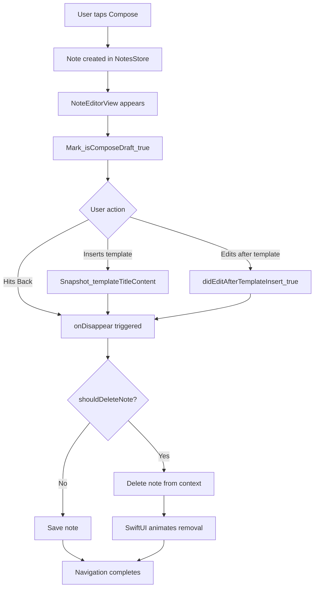

# Auto-deletion Feature for Empty Notes

## Overview

When a user creates a new note and immediately navigates back without editing, or inserts a template without modifying it, the note should be automatically deleted. The deletion will trigger SwiftUI's built-in list animations, creating a "ghost row" effect where the note briefly appears then slides away.

## Implementation Details

### 0. Scope: compose-created notes only (iOS-like)

Auto-delete must **only** apply to the note created via the Compose button for this navigation session. This prevents accidental deletion of existing notes a user opens from the list and clears.Implement by updating [`ContentView.swift`](notes-workout-log/ContentView.swift):

- Add `@State private var draftNoteID: UUID?`
- In `composeNote()`, after creation: set `draftNoteID = note.id` before pushing the navigation
- In `.navigationDestination(for: Note.self)`, pass `isComposeDraft: (note.id == draftNoteID)` into `NoteEditorView`
- Also pass `draftNoteID` as a binding so `NoteEditorView` can clear it on exit (after save or delete)

### 1. Track Note State in NoteEditorView

Modify [`NoteEditorView.swift`](notes-workout-log/Views/NoteEditorView.swift) to:

- Add inputs:
- `let isComposeDraft: Bool`
- `@Binding var draftNoteID: UUID?` (so we can clear it on exit)
- Add state variables to track the template “unchanged” rule:
- `templateWasInserted: Bool`
- `templateSnapshotTitle: String`
- `templateSnapshotContent: String`
- `didEditAfterTemplateInsert: Bool`
- `isApplyingTemplate: Bool` (prevents the insert itself from counting as an “edit”)

### 2. Implement Empty + Template-Unchanged Check Logic

Add a computed property `shouldDeleteNote` that returns `true` only when `isComposeDraft == true` AND either:

- **Empty-note rule**: `content.trimmingCharacters(in: .whitespacesAndNewlines).isEmpty` AND `titleDraft.trimmingCharacters(in: .whitespacesAndNewlines).isEmpty`
- **Template-unchanged rule**: `templateWasInserted == true` AND `didEditAfterTemplateInsert == false` AND `titleDraft == templateSnapshotTitle` AND `content == templateSnapshotContent`

### 3. Track “edited after template”

In `insertTemplate(_:)`:

- Set `isApplyingTemplate = true`
- Apply template (update `titleDraft`, commit title, update `content`)
- Set:
- `templateWasInserted = true`
- `didEditAfterTemplateInsert = false`
- `templateSnapshotTitle = titleDraft`
- `templateSnapshotContent = content`
- Set `isApplyingTemplate = false`

In `onChange(of: content)` and `onChange(of: titleDraft)`:

- If `templateWasInserted && !isApplyingTemplate` and new values differ from the snapshot, set `didEditAfterTemplateInsert = true`

### 4. Auto-delete on Disappear

Modify `onDisappear` in `NoteEditorView` to:

- Cancel `saveTask` first to prevent late saves after leaving
- If `shouldDeleteNote` is true, call `store.deleteNote(note)` and clear `draftNoteID = nil`
- Otherwise, call `saveImmediately()` and clear `draftNoteID = nil`
- The note will be removed from SwiftData context, triggering SwiftUI's automatic list animations

Also update the custom toolbar Back button in `NoteEditorView` to **only** call `dismiss()` (no direct `saveImmediately()`), so swipe-back and button-back share the same exit path.

### 5. Handle Edge Cases

- Ensure `saveTask` is cancelled before delete/save to avoid racing async saves
- Use `store.deleteNote()` which already handles SwiftData context deletion and saving
- The visual "ghost row" effect will occur automatically via SwiftUI's `@Query` updates when the note is deleted from the context

## Data Flow

## Files to Modify

- [`notes-workout-log/ContentView.swift`](notes-workout-log/ContentView.swift) - Track `draftNoteID` and pass compose-draft gating into editor
- [`notes-workout-log/Views/NoteEditorView.swift`](notes-workout-log/Views/NoteEditorView.swift) - Add compose-draft gating, template snapshot tracking, and deletion logic

## Testing Considerations

- Empty note (no content, no title) → should delete
- Note with template but no edits → should delete  
- Note with template and edits → should save
- Note with content but no title → should save