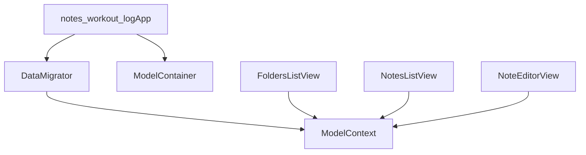

# SwiftData Migration (Local-only) — Updated Plan

## Decisions Locked

- **Persistence**: SwiftData (no CloudKit in this iteration)
- **Identity**: Preserve existing UUIDs as explicit model fields (`id: UUID`) for safe migration + stable navigation
- **Sorting/grouping**: Keep current behavior (month grouping + sorting based on `sortDate`, which does not change on edit)
- **UI approach**: SwiftData-first — lists driven by `@Query` / `ModelContext`; remove or heavily trim `FoldersViewModel` and `NotesViewModel`

## What’s inaccurate in the previous plan (and fixed here)

- SwiftData `@Model` types are not `Hashable`, so current value-based navigation (`NavigationLink(value:)` + `NavigationPath.append(note)`) will break.
- Relying only on SwiftData’s internal identity makes migration and stable navigation harder; we’ll keep your existing `id: UUID` fields.
- “Automatic iCloud sync readiness” was misleading; CloudKit is explicitly out of scope.

## Target Files

- Update models:
- [`notes-workout-log/Models/Folder.swift`](notes-workout-log/Models/Folder.swift)
- [`notes-workout-log/Models/Note.swift`](notes-workout-log/Models/Note.swift)
- Configure container + run migration:
- [`notes-workout-log/notes_workout_logApp.swift`](notes-workout-log/notes_workout_logApp.swift)
- New: `notes-workout-log/Persistence/DataMigrator.swift`
- Update views (navigation + queries):
- [`notes-workout-log/Views/FoldersListView.swift`](notes-workout-log/Views/FoldersListView.swift)
- [`notes-workout-log/Views/NotesListView.swift`](notes-workout-log/Views/NotesListView.swift)
- [`notes-workout-log/Views/NoteEditorView.swift`](notes-workout-log/Views/NoteEditorView.swift)
- Remove/trim viewmodels (depending on what’s still useful after conversion):
- [`notes-workout-log/ViewModels/FoldersViewModel.swift`](notes-workout-log/ViewModels/FoldersViewModel.swift)
- [`notes-workout-log/ViewModels/NotesViewModel.swift`](notes-workout-log/ViewModels/NotesViewModel.swift)
- [`notes-workout-log/ViewModels/NoteEditorViewModel.swift`](notes-workout-log/ViewModels/NoteEditorViewModel.swift)

## Data Model (SwiftData)

### Folder

- `id: UUID` (unique)
- `name: String`
- `isSystemFolder: Bool`
- Relationship: `notes: [Note]` (cascade delete)

### Note

- `id: UUID` (unique)
- `content: String`
- `sortDate: Date` (kept; drives grouping)
- `createdDate: Date`
- Relationship: `folder: Folder`
- Keep computed properties `title` and `preview`

## Navigation Strategy (no Hashable requirements)

- Replace value-based navigation with destination-based links:
- Folder row: `NavigationLink { NotesListView(folder: folder) } label: { ... }`
- Note row: `NavigationLink { NoteEditorView(note: note) } label: { ... }`
- For the “compose” action in `FoldersListView`, create a note in a chosen folder and present the editor using `navigationDestination(item:)` (or a sheet) with an `@State` holding the created `Note` (or its UUID).

## SwiftData-first Queries

- `FoldersListView` uses `@Query(sort: ...) var folders: [Folder]`.
- `NotesListView` uses `@Query` filtered to the passed folder (predicate using relationship or folder `id`).
- Search stays as in-memory filtering on the queried results for now (simple and predictable).

## One-time Migration (UserDefaults → SwiftData)

### Migration rules

- Read UserDefaults keys: `savedFolders`, `savedNotes`
- Decode `[Folder]` + `[Note]` from JSON
- Insert SwiftData `Folder` records preserving `id`
- Insert SwiftData `Note` records preserving `id`, `content`, `sortDate`, `createdDate`
- Rebuild relationships by mapping `note.folderId` → `Folder.id`
- If a note’s folder is missing, attach it to the default folder (“Notes”)
- Save context
- Mark success via `didMigrateToSwiftData = true`
- On success, delete old UserDefaults payload keys to avoid double sources of truth

### Default folder

- If there are zero folders after migration (or on first install), create a single “Notes” folder.

## Data Flow Diagram

## Acceptance Criteria

- Existing UserDefaults data migrates once into SwiftData and remains visible
- Creating/editing/deleting folders and notes works as before
- Folder deletion cascades notes (or folder deletion is disabled if you prefer later)
- No crashes from `fatalError` paths related to “currentFolderId” (should disappear with SwiftData-first approach)

## Rollout / Safety

- Migration is idempotent (guarded by `didMigrateToSwiftData`)
- If migration fails decoding, app still boots with an empty SwiftData store + default folder

## Implementation Todos

- `models`: Convert `Folder` + `Note` to SwiftData `@Model` classes, keep `id: UUID` and relationships
- `container`: Configure `ModelContainer` in `notes_workout_logApp` and inject with `.modelContainer(...)`
- `migrator`: Implement `DataMigrator` (decode UserDefaults → insert SwiftData → mark migrated → clear old keys)
- `views_nav`: Update `FoldersListView` / `NotesListView` / `NoteEditorView` to use destination-based navigation (no `NavigationPath` with model values)